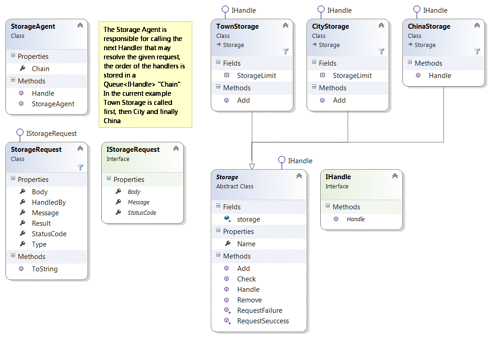

# Структурни Шаблони

## Facade

Целта на този шаблон е да избегне coupling-a ("обвързването") между изпращача и получателя на дадена заявка и да даде възможност на повече от един обект да опитат да обработят заявката. Създава се верига от обработващи елементи(handler-и), а заявката се препраща към края на веригата, докато не бъде обработена или не стигне края.

Този шаблон може да се приложи когато имаме вариращ брой handler-и и поток от заявки които трябва да бъдат обработени

## Диаграма



---

### Handle Методът от StorageAgent

```C#
public string Handle(object request, RequestType type)
{
    var currentRequest = new StorageRequest(request, type);
    
    foreach (var handler in Chain)
    {
        handler.Handle(currentRequest);
        if (currentRequest.Result)
        {
            break;
        }
    }

    return currentRequest.ToString();
}

```

### Базовият метод за обработване на заявки

```C#
public virtual void Handle(StorageRequest request)
{
    try
    {
        switch (request.Type)
        {
            case RequestType.Add:
                this.Add(request.Body);
                this.RequestSeuccess(request);

                break;
            case RequestType.Check:
                if (this.Check(request.Body))
                {
                    this.RequestSeuccess(request);
                }
                else
                {
                    this.RequestFailure(request, 404, "Not Found");
                }

                break;
            case RequestType.Buy:
                if (this.Remove(request.Body))
                {
                    this.RequestSeuccess(request);
                }
                else
                {
                    this.RequestFailure(request, 404, "Not Found");
                }

                break;
            default:
                break;
        }
    }
    catch (ApplicationException ex)
    {
        this.RequestFailure(request, 403, ex.Message);
    }
}
```

---

*За повече подробности може да разгледате целия проект*
