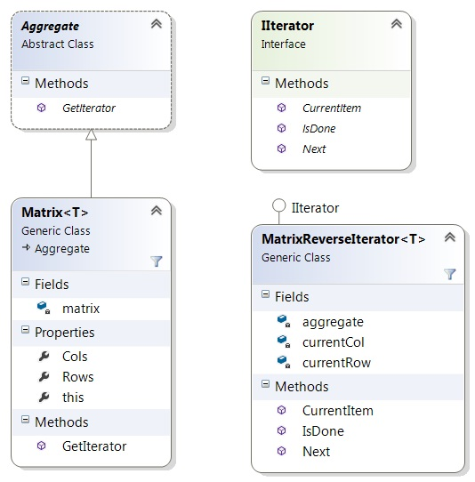

## Iterator

Този шаблон дава възможност за обхождане на елементите от даден обект във избрана последователност без да разкрива логиката зад тази имплементация 

Получваме възможност да имплементираме различни алгоритми за обхождане, като следенето до коя стъпка сме стигнали се помни във Iterator-а, а не във обходждания обект

Дава възможност алгоритъмът за обходжане да бъде сменен в по - късен етап

Използва се за да улесни и уеднакви достъпът до различни структури от данни 

Изгражда се по следния начин:
В обекта в който искаме да приложим Iterator създаваме метод GetIterator(),
чрез който давмае достъп на итератора до дадената структура от данни.
След което се създава обекта Iterator който ще съдържа логиката за обхождане на данните - методи като First(), Next(), Current() и Done()

## Диаграма



---

### Структурата на Matrix

```C#
public class Matrix<T> : Aggregate
{
    private readonly T[,] matrix;

    public Matrix(int rows, int cols)
    {
        this.matrix = new T[rows, cols];
    }

    public int Rows
    {
        get
        {
            return this.matrix.GetLength(0);
        }
    }

    public int Cols
    {
        get
        {
            return this.matrix.GetLength(1);
        }
    }

    public T this[int row, int col]
    {
        get
        {
            return this.matrix[row, col];
        }

        set
        {
            this.matrix[row, col] = value;
        }
    }

    public override IIterator GetIterator()
    {
        return new MatrixReverseIterator<T>(this);
    }
}
```

### Iterator-ът MatrixReverse 

```C#
 public class MatrixReverseIterator<T> : IIterator
    {
        private readonly Matrix<T> aggregate;

        private int currentRow;

        private int currentCol;

        public MatrixReverseIterator(Matrix<T> aggregate)
        {
            this.aggregate = aggregate;
            this.currentRow = aggregate.Rows - 1;
            this.currentCol = aggregate.Cols - 1;
        }

        public void Next()
        {
            if (currentCol > 0)
            {
                this.currentCol--;
            }
            else 
            {
                this.currentRow--;
                this.currentCol = this.aggregate.Cols - 1;
            }
        }

        public object CurrentItem()
        {
            return this.aggregate[this.currentRow, this.currentCol];
        }

        public bool IsDone()
        {
            return this.currentRow <= -1;
        }
    }
```

---

*За повече подробности може да разгледате целия проект*
