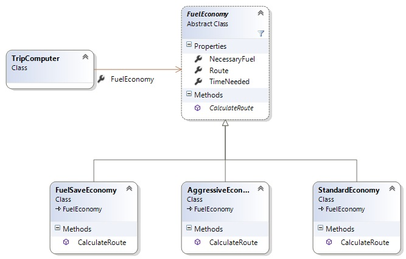

## Strategy

Чрез този шаблон се енкапсулира група от сходни обекти по средством наследяване на базов клас или ползване на общ интерфейс, като по този начин се осигурява начин тези обекти да се разширяват и променят отделно от обекта който ги използва. Така се подпомагат SOLID принципите Open/Closed - функционалността се разраства чрез наследяване на базовия обект(имплементиране на интерфейс-а) и Dependency Inversion - клиентът който ползва дадените обекти се обвързва към абстракцията която те развиват, а не към конкретното имплементиране.

Разрешава проблеми като: 
* Сложна Switch/If логика, като я заменя с полиморфизъм.
* Когато добавянето на нова функционалност налага повече от една модификация на обекта/

## Диаграма

---

*За повече подробности може да разгледате целия проект*
