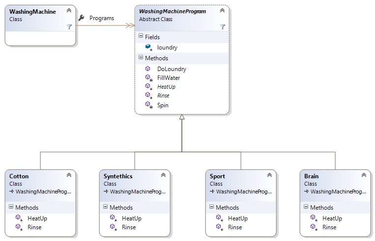

## Template Method

Чрез този шаблон се създава обект, който съдържа стъпките на даден алгоритъм, като някой от тези стъпки са стандартни, а други трябва да бъдат оставени за имплементиране от наследниците на този обект. Така обекти които използват сходен алгоритъм могат да преизползват template method-a и да се избегне повторени на код. Базовият обект трябва да се изгради по такъв начин по който да позволява на наследниците си да имплементират само конкретни стъпки от алгоритъма, без да променят редът за изпълнение. 

## Диаграма



---

## Код от базовият обект:

```C#
public abstract class WashingMachineProgram
{
    protected string loundry;

    private void FillWater()
    {
        text.PrintColorText("Filling with water\n", ConsoleColor.DarkBlue);
    }

    private void Spin()
    {
        text.PrintColorText("Centrifuging loundry\n", ConsoleColor.DarkRed);
        this.loundry = multipleWhite.Replace(this.loundry, " ");
        this.loundry = this.loundry.Trim();
    }

    protected abstract void HeatUp();

    protected abstract void Rinse();

    public string DoLoundry(string loundry)
    {
        this.loundry = loundry;

        text.PrintColorText("Initiating washing proragm...\n", ConsoleColor.DarkGreen);

        this.FillWater();
        this.HeatUp();
        this.Rinse();
        this.Spin();

        text.PrintColorText("Washing completed, enjoy the result\n", ConsoleColor.DarkGreen);

        string cleanLoundry = this.loundry;
        this.loundry = String.Empty;

        return cleanLoundry;
    }
}
```

*За повече подробности може да разгледате целия проект*
