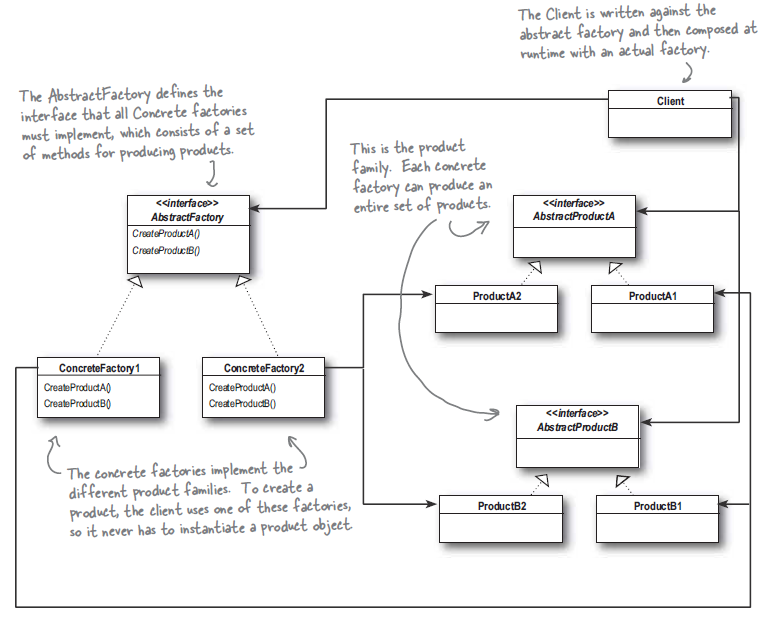

# Шаблони за създаване

## Abstract Factory
Чрез `Factory` шаблонът избягваме обвързването към конкретни инстанции
на даден обект, като енкапсулираме създаването на обектите на едно място -
factory-то, на всички останали места използваме тяхна абстракция (интерфейс)
която се връща от factory-то. По този начин по - лесно може да сменим 
имплементацията на дадена абстракция/интерфейс като единствено променим
логиката във factory-то.  
`Abstract Factory` разкрива интерфейс за създаване на група от продукти.
По този начин се разкачаме от конкретната имплементация на `Factory` която
създава самите обекти. Това ни ползволява да направим различни имплементации
на `Factory` които връщат обекти според специфичните нужди на приложенито,
ако се налага различна имплементация за различни региони, операционни системи,
или дизайн.  
Често методите във `Abstract Factory` са имплементация на `Factory Method`,
те са абстрактни методи, по този начин конкретната имплементация се 
диктува от техният наследник (класът който ги имплементира)

## Диаграма:

 

## Пример
Не е необходимо да подкарате примера за да разберете как работи, но 
ако имате инсталиран nodejs, направете `npm start` във folder-а `example`

За да бъде по кратък примера резултатите/продуктите от `Abstract Factory`
са във формата на `String`, което обезсмисля методи като createElement и
createAttribute, това е единствено с цел да се намали обемът на примера.
Във едно истиснко приложение щеше да бъде имплементиран абстрактен модел
за `Document` и неговите наследници които конкретните factory-та биха
произвеждали `JsonDocument`, `HtmlDocument` и така нататък.