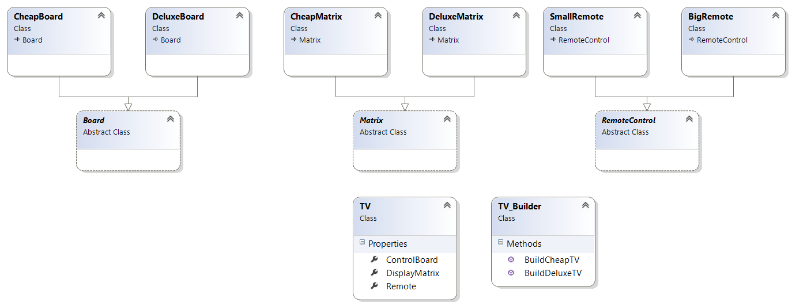

# Шаблони за създаване

## Builder

Този шаблон разделя създавнето на сложни обекти на стъпки, по определен ред.
Така се постига разгреничение между логика и данни, енкапсулира се начина по който обектите биват създадени.
Най често решава проблеми като: 
	* Когато имаме твърде много параметри; 
	* Има зависимост в каква последователност ще се извикат констукторите

Често този шаблон се допълва с някой от другите шаблони за създаване, като Factory.	

## Диаграма:

 

---

## TV_Builder.cs

```C#
public class TV_Builder
{
    public TV BuildCheapTV()
    {
        var cheapTB = new TV();
        cheapTB.ControlBoard = new CheapBoard();
        cheapTB.DisplayMatrix = new CheapMatrix();
        cheapTB.Remote = new SmallRemote();

        return cheapTB;
    }

    public TV BuildDeluxeTV()
    {
        var deluxeTV = new TV();
        deluxeTV.ControlBoard = new DeluxeBoard();
        deluxeTV.DisplayMatrix = new DeluxeMatrix();
        deluxeTV.Remote = new BigRemote();

        return deluxeTV;
    }
}
```