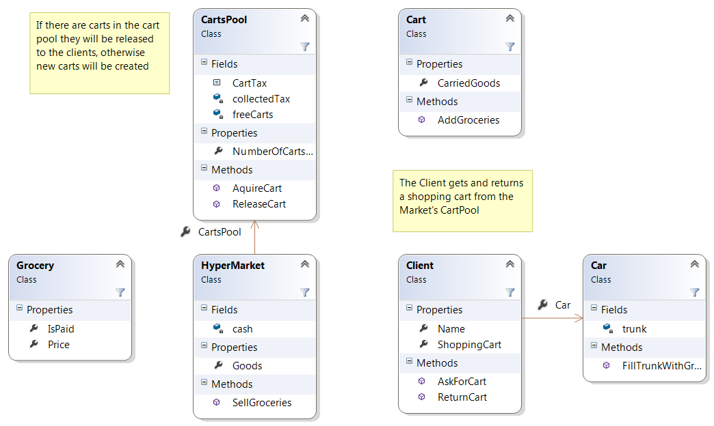

# Шаблони за създаване

## Object Pool 

Чрез този шаблон се избягва създаването на нови инстанции когато това не е небоходимо за да се съхранят ресеурси. Това води до увеличаване на производителността.
Логиката зад този принцип се състои в това, когато правим заявка към даден ресурс, той да бъде създаден, а след като приключим със използването му, да не бъде унищожен, а да бъде съхранен, като преди това бъде зачистен от данните с които сме го ползвали, така в по - късен етап вместо да създаваме нова инстанция от същия вид може да преизползваме складираната.

Често този шаблон имплементира Singleton, за да има само един Object Pool

## Диаграма:

 

---

## CartPool.cs

```C#
public class CartsPool
{
    public const decimal CartTax = 0.50m;

    private List<Cart> freeCarts;

    private decimal collectedTax;

    public CartsPool()
    {
        this.freeCarts = new List<Cart>();
    }

    public int NumberOfCartsInPool
    {
        get
        {
            return this.freeCarts.Count;
        }
    }

    public Cart ReleaseCart(decimal receivedTax)
    {
        if (receivedTax < CartTax)
        {
            throw new ApplicationException("Call the police!");
        }
        else
        {
            this.collectedTax += receivedTax;
        }

        Cart currentCart;

        if (this.freeCarts.Count == 0)
        {
            currentCart = new Cart();
        }
        else
        {
            int lastCart = this.freeCarts.Count - 1;
            currentCart = this.freeCarts[lastCart];
            this.freeCarts.RemoveAt(lastCart);
        }

        return currentCart;
    }

    public decimal AquireCart(Cart returnedCart)
    {
        decimal refundedTax;

        if (returnedCart.CarriedGoods.Count > 0) 
        {
            returnedCart.CarriedGoods.RemoveRange(0, returnedCart.CarriedGoods.Count);

            Console.WriteLine("Shto si ostaviate boklucite vytre!? Globa!");
            refundedTax = CartTax / 2;
        }
        else
        {
            refundedTax = CartTax;
        }

        this.collectedTax -= refundedTax;
        this.freeCarts.Add(returnedCart);

        return refundedTax;
    }
}
```

За повече подробности може да разгледате целият проект.

