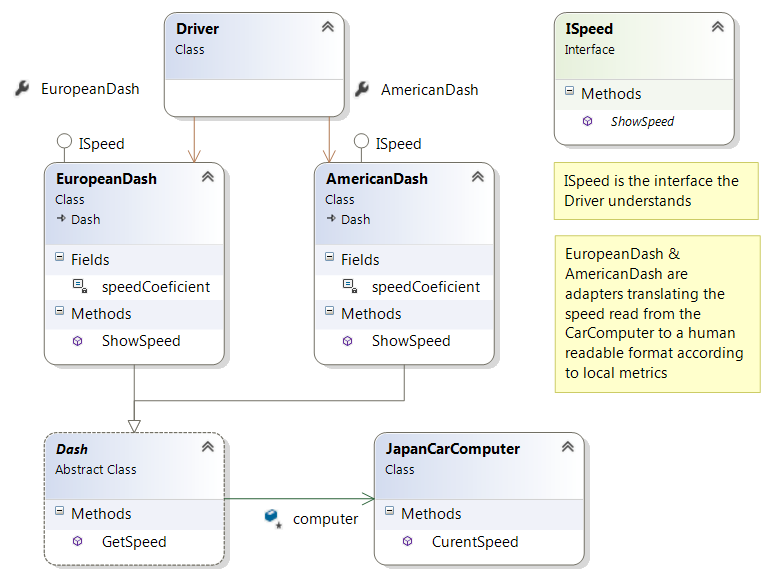

# Структурни Шаблони 

## Adapter

Този шаблон разрешава проблемът възникващ когато искаме да ползваме функционалността на даден обект но не може да го свържем директно към вече създадения от нас код, защото няма съвместимост(пр. методите от несъвместимия клас се изикват с определени парамтетри с които не разполагаме директно).

*Adapter*-ът превежда подадените и получените данни между нашият и адаптираният обект


## Диаграма:

 

--- 

## Извадка с примерен код:

```C#
public class CarComputer
{
    public double CurentSpeed()
    {
        return 50;
    }
}

public abstract class Dash
{
    protected CarComputer computer;

    public double GetSpeed(CarComputer computer)
    {
        return computer.CurentSpeed();
    }
}

 public class AmericanDash : Dash, ISpeed
{

    private const double speedCoeficient = 1.66;

    public void ShowSpeed()
    {
        Console.WriteLine("Speed: {0}mph", this.GetSpeed(this.computer) * speedCoeficient);
    }
}

public class EuropeanDash : Dash, ISpeed
{
    private const double speedCoeficient = 0.984;

    public void ShowSpeed()
    {
        Console.WriteLine("Speed: {0}km/h",this.GetSpeed(this.computer) * speedCoeficient);
    }
}


```