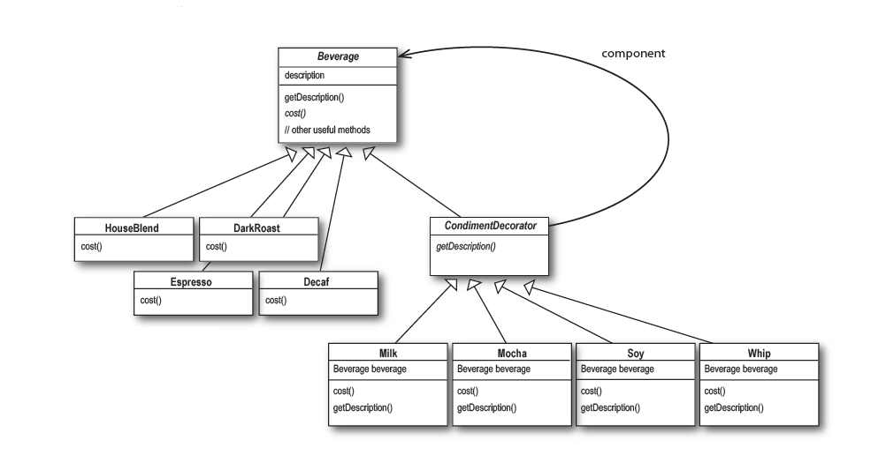

# Шаблони за създаване

## Decorator

Този шаблон ни дава възможност да добаваяме, динамично, допълнително
поведение на дедн обект/и, без да се налага да променяме текущата
имплементация на съществуващ тип.  
Шаблонът се прилага като wrapper (обгъща), на вече съществуващ 
обект/клас, като имплементира неговият интерфейс.  
Често декорираният обект се приема като параметър в конструктора 
на декоратора. Така декораторът е свободен да извършва надграждащи
действия, след което да делегира изпълнението към обгърнатият обект.

Тъй като декоратора имплементира същият интерфейс, като декориранят
обект е възможно да се навържат много на брой декоратори:
декоратор -> декоратор -> декоратор -> обект  
Това обикновенно води до усложнение на дизайна и конструкцията на 
декорираните обекти и налага създаване на `Factory` за декорирани
обкети

## Диаграма:

 

## Пример
Не е необходимо да подкарате примера за да разберете как работи, но 
ако имате инсталиран nodejs, направете `npm start` във folder-а `example`

```javascript
let espresso = new Espresso();

// add milk decoration to espresso
let withMilk = new MilkFlavor(espresso);

// add acid decoration to espresso with milk
let withAcid = new AcidFlavor(withMilk);

console.log(withAcid.taste());
// Tastes like espresso coffee with a bit of milk, a distinct taste of sulfuric acid
```
