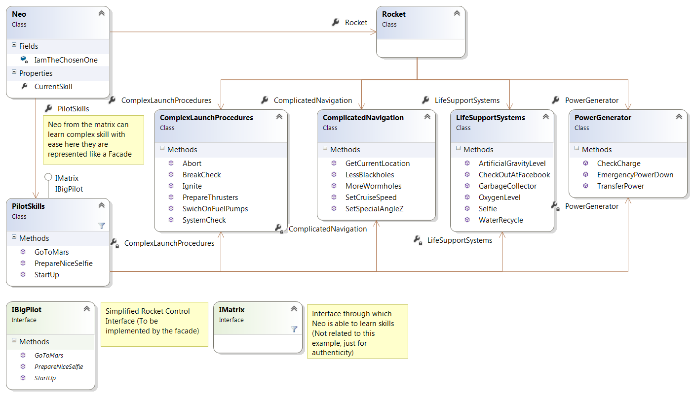

## Примерена Диаграма:


##

## Примерен Код:

```C#
// Extracted from PilotSkills

public void StartUp()
{
    try
    {
        this.StartLogging();

        this.ComplexLaunchProcedures.SystemCheck();
        this.PowerGenerator.CheckCharge();
        this.PowerGenerator.TransferPower();
        this.ComplexLaunchProcedures.BreakCheck();
        this.ComplexLaunchProcedures.SwichOnFuelPumps();
        this.ComplexLaunchProcedures.PrepareThrusters();
        Console.WriteLine(3);
        Console.WriteLine(2);
        Console.WriteLine(1);
        this.ComplexLaunchProcedures.Ignite();
    }
    catch (ArgumentNullException ex)
    {
        Console.WriteLine("Critical Error... Abortring");
        Console.WriteLine("Read this while Im working: \n{0}", ex.Message);
        this.ComplexLaunchProcedures.Abort();
        this.PowerGenerator.EmergencyPowerDown();
    }
    finally
    {
        this.TransmitMessage(this.missionLog);
    }
}

public void GoToMars()
{
    try
    {
        this.PowerGenerator.TransferPower();
        this.ComplicatedNavigation.SetSpecialAngleZ();
        this.ComplicatedNavigation.SetCruiseSpeed();
        this.ComplicatedNavigation.LessBlackholes();
    }
    catch (ArgumentException ex)
    {
        Console.WriteLine("Go to the engine department and tell the guy to fix this: \n{0}", ex.Message);
    }
    finally
    {
        this.TransmitMessage(this.missionLog);
    }
}

public void PrepareNiceSelfie()
{
    this.PowerGenerator.TransferPower();
    this.LifeSupportSystems.OxygenLevel();
    this.LifeSupportSystems.Selfie();
    this.ComplicatedNavigation.GetCurrentLocation();
    this.LifeSupportSystems.CheckOutAtFacebook();
}
```

