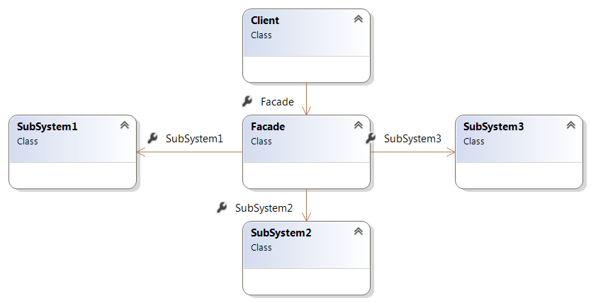

# Структурни Шаблони

## Facade

Целта на този шаблон е да създаде по - удобен достъп до даден обект/и , като обгърне вече съществуващ код / библиотека с обект със по - прост интерфейс. Работа на този обект трябва да бъде само като посредник между клиента и дадената библиотека/обекти. 

Не е задължително фасадата напълно да препокрие съществуващия интерфейс, или да ограничи извикването му да бъде само през нея, а по - скоро да опрости извикването на код който често се ползва по определен начин (пр. в определена последователност) или да свърже сложна система от компоненти в един общ интерфейс.

## Диаграма
