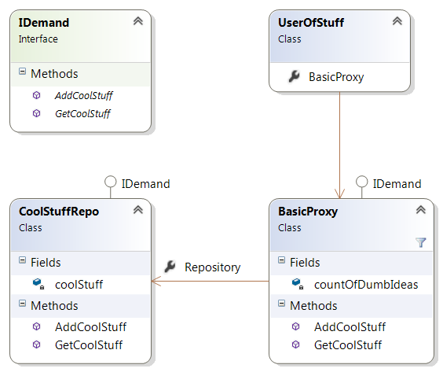

# Структурни Шаблони 

## Proxy

По този шаблон се създава интерфейс през който клиент се свързва с даден обект, като така може да се добави допълнителна функционалност без да се налага променянето на кода в крайния обект. Proxy-то се изгражда по такъв начин че сякаш се свързваме с крайния продукт директно, а не чрез посредник.

Допълнително може да се имплементира Lazy Initialization, за да не се зарежда крайният обект освен ако не е изрично извикан.

**Примери**:

* Ограничаване на достъпа на потребители до крайните ресурси спрямо логиката в Proxy-то
* Свързващ интерфейс към REST ресурси 
* На Proxy-то могат да се кешират вече достъпени ресурси за по бързо извикване по - късно


**Диаграма**:

  

**Извадка от BasicProxy**:

```C#
namespace ProxyPatternExample
{
    using System;
    using System.Collections.Generic;

    public class BasicProxy : IDemand
    {
        private Random rndGenerator;

        private CoolStuffRepo repository;

        private int countOfDumbIdeas = 0;

        public CoolStuffRepo Repository
        {
            get
            {
                // Lazy Init...
                if (this.repository == null)
                {
                    this.repository = new CoolStuffRepo(); // Not Cool
                }

                return this.repository;
            }
        }

        public IReadOnlyCollection<string> GetCoolStuff()
        {
            // Proxy rule N1: Everyone can receive the Cool Stuff!
            return this.Repository.GetCoolStuff();
        }

        public void AddCoolStuff(string coolStuff)
        {
            int magicNumber = this.rndGenerator.Next(1, 11);

            // Proxy rule N2: Only the worthy shall pass! ... or if u r stubborn enough.
            bool isItReallyCoolStuff = (coolStuff.Length > 3) && (magicNumber > 4);

            if (isItReallyCoolStuff)
            {
                this.Repository.AddCoolStuff(coolStuff);   
            }
            else
            {
                this.countOfDumbIdeas++;
                throw new ApplicationException("Sorry, it seems your stuff was so dumb it would have crashed the program if it wasn't I");
            }      
        }
    }
}

```